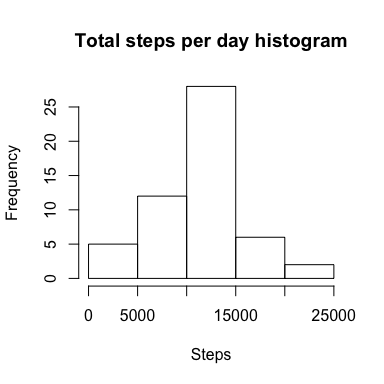
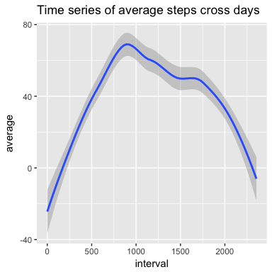
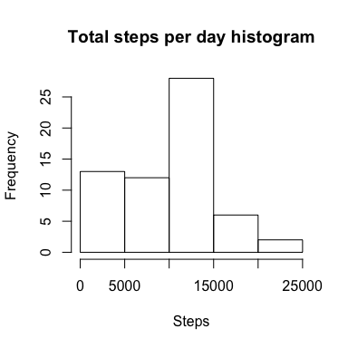
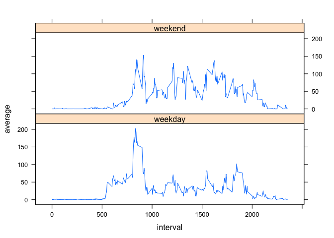

# Reproducible Research: Peer Assessment 1

```r
library(knitr)
opts_chunk$set(echo=TRUE, message=FALSE, warning=FALSE)
```


## Loading and preprocessing the data

```r
activity <- read.csv("activity.csv")
activity$date <- as.Date(as.character(activity$date))
```


## What is mean total number of steps taken per day?

```r
#calculate total steps per day with missing values
library(dplyr)
stepsByDay <- activity %>% group_by(date) %>% summarise(total = sum(steps))
#make histogram of total steps per day
hist(stepsByDay$total, main = "Total steps per day histogram", xlab = "Steps", ylab = "Frequency")
```

<!-- -->

```r
#Calculate and report the mean and median total number of steps taken per day
averageSteps <- mean(stepsByDay$total, na.rm = TRUE)
medianSteps <- median(stepsByDay$total, na.rm = TRUE)
```
Average steps across all days (excluding missing values) is 10766.19  
Median steps across all days (excluding missing values) is 10765


## What is the average daily activity pattern?

```r
#1. Make a time series plot (i.e. type = "l") of the 5-minute interval (x-axis) and the average number of steps taken, averaged across all days (y-axis)

#Average by interval across days 
stepsByInterval <- activity %>% group_by(interval) %>% summarise(average = mean(steps, na.rm = TRUE))

#Time series plot
library(ggplot2)
qplot(interval, average, data = stepsByInterval, main = "Time series of average steps cross days", geom = "smooth")
```

<!-- -->

```r
#2. Which 5-minute interval, on average across all the days in the dataset, contains the maximum number of steps?
#Find max
maxInterval <- stepsByInterval[which.max(stepsByInterval$average), ]$interval
```
Interval : 835 has max number of steps


## Imputing missing values

```r
#1. Calculate and report the total number of missing values in the dataset (i.e. the total number of rows with NAs)
totalMissing <- sum(is.na(activity$steps))
totalMissing
```

```
## [1] 2304
```

```r
#2. Devise a strategy for filling in all of the missing values in the dataset. The strategy does not need to be sophisticated. For example, you could use the mean/median for that day, or the mean for that 5-minute interval, etc.
library(Hmisc)
#impute using median for steps
#Create a new dataset that is equal to the original dataset but with the missing data filled in.
imputedActivity <- activity
imputedActivity$steps <- with(imputedActivity, impute(steps, median))


#4. Make a histogram of the total number of steps taken each day and Calculate and report the mean and median total number of steps taken per day. Do these values differ from the estimates from the first part of the assignment? What is the impact of imputing missing data on the estimates of the total daily number of steps?
imputedStepsByDay <- imputedActivity %>% group_by(date) %>% summarise(total = sum(steps))
hist(imputedStepsByDay$total, main = "Total steps per day histogram", xlab = "Steps", ylab = "Frequency")
```

<!-- -->

```r
imputedMeanSteps <- mean(imputedStepsByDay$total)
imputedMeanSteps
```

```
## [1] 9354.23
```

```r
imputedMedianSteps <- median(imputedStepsByDay$total)
imputedMedianSteps
```

```
## [1] 10395
```
Both mean and median decreased after missing value are filled in with median values. 

## Are there differences in activity patterns between weekdays and weekends?


```r
#Create a new factor variable in the dataset with two levels – “weekday” and “weekend” indicating whether a given date is a weekday or weekend day.
imputedActivity$day <- ifelse(weekdays(imputedActivity$date) %in% c("Saturday", "Sunday"), "weekend", "weekday")
imputedActivity$day <- as.factor(imputedActivity$day)

#Make a panel plot containing a time series plot (i.e. type = "l") of the 5-minute interval (x-axis) and the average number of steps taken, averaged across all weekday days or weekend days (y-axis). The plot should look something like the following, which was creating using simulated data:

#Average cross days
stepsByIntervalImputed <- imputedActivity %>% group_by(day, interval) %>% summarise(average = mean(steps))

xyplot(average~interval|day, data = stepsByIntervalImputed, layout= c(1, 2), type = "l")
```

<!-- -->

